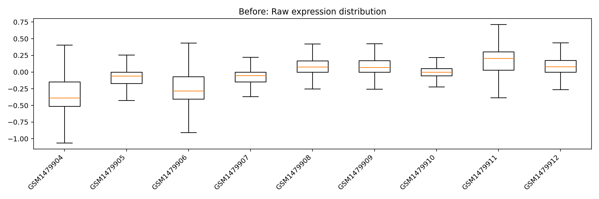
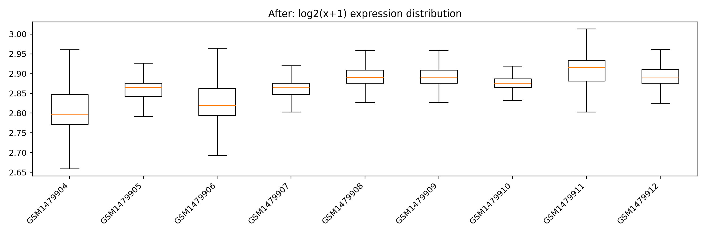
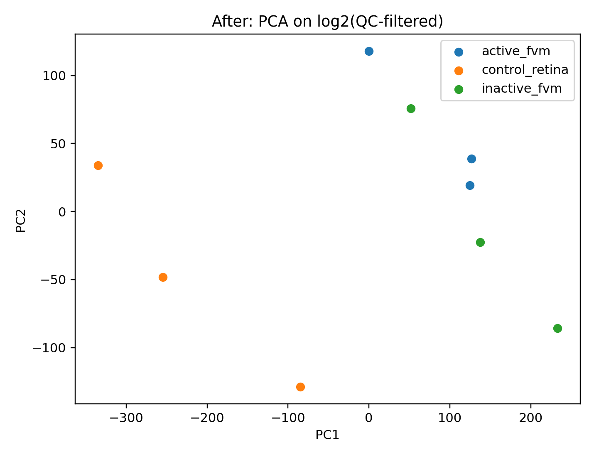

# Project: GEO Disease Signature → Pathways → Drug Repurposing (Ophthalmology)
---

**Goal:** Build an end-to-end translational bioinformatics workflow that starts from a public GEO study, derives disease gene signatures, interprets biology via pathway enrichment, and proposes drug repurposing candidates using perturbation/drug signature libraries.

---
### Dataset
- GEO: **GSE60436** (retina / fibrovascular membrane groups)

---
### Pipeline
1. **Download & parse GEO** → expression matrix + phenotype labels  
   `python src/01_download_geo.py --gse GSE60436`
2. **QC** → missingness, sample correlation, PCA  
   `python src/02_qc.py`
3. **Differential Expression** (per probe, group contrasts)  
   `python src/03_differential_expression.py`
4. **Enrichment** (GO/KEGG/Reactome via Enrichr)  
   `python src/04_enrichment.py --fdr 0.05 --fc 1.0`
5. **Drug Repurposing** (DSigDB + LINCS + GEO drug perturbations)  
   `python src/05_drug_repurposing.py --fdr 0.05 --fc 1.0 --top_n 25`
6. **One-click report**  
   `python src/06_make_report.py`

---
### Key Results

Generated disease gene signatures for active/inactive FVM vs control retina, visualized via volcano plots.

Identified biologically relevant pathways via GO/KEGG/Reactome enrichment and produced ranked drug/perturbation matches using DSigDB/LINCS.

> Note: DSigDB includes chemical exposure associations (not all are actionable therapeutics). Candidate lists should be filtered/validated before interpretation.

---
### Outputs
- `results/figures/` → QC plots, volcano plots, enrichment plots, drug candidate plots  
- `results/tables/` → DEG tables, enrichment tables, drug candidate rankings  
- `results/summary.md` → final stitched report

> **Disclaimer:** Computational hypothesis generation only; not medical advice.

---
## Full Results Gallery
📌 All plots + top tables in one place: **[results/gallery.md](results/gallery.md)**  
📌 Auto report: **[results/summary.md](results/summary.md)**

---
## Before vs After (QC / Normalization)

  
  

**Interpretation:**  
- Left (raw): sample distributions may vary due to scale/skew differences.  
- Right (log2): distributions become more comparable, stabilizing variance for downstream analyses.

  
  

**Interpretation:**  
- PCA helps check whether groups separate biologically and whether QC reduces noise/outliers.

---

### Future Work

Direction-aware reversal scoring for LINCS: match disease-UP to drug-DOWN and disease-DOWN to drug-UP for more faithful “reversal” logic.

Batch correction & covariates: add ComBat / regression adjustment if metadata supports it.

Gene-level modeling: move from probe-level DE to gene-level DE with robust aggregation and platform-aware normalization.

Validation: compare signatures with independent retina/FVM datasets, and prioritize candidates via consensus across multiple libraries.

Clinical filtering: remove non-actionable toxicants/exposures from DSigDB and keep clinically relevant compounds.

---
References

NCBI GEO: GSE60436 (Gene Expression Omnibus)

GEOparse (GEO parsing in Python)

Enrichr (gene set enrichment web resource) + gseapy (Python interface)

DSigDB (drug signatures database)

LINCS L1000 (perturbational gene expression signatures)

