# Results Gallery

Auto-generated gallery of QC, DEG, enrichment, and drug repurposing plots.

## QC

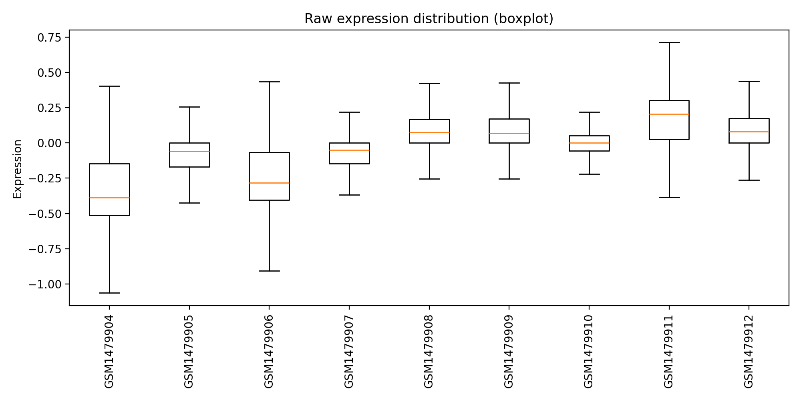

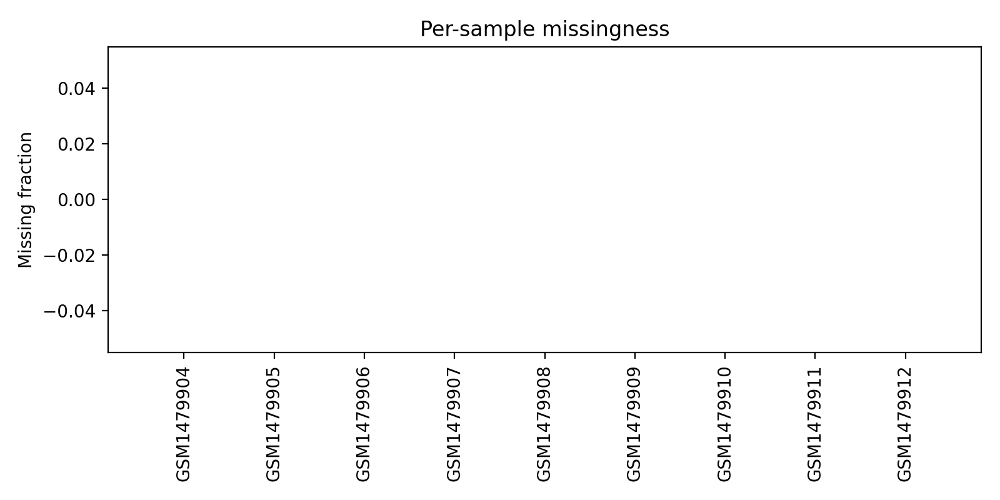

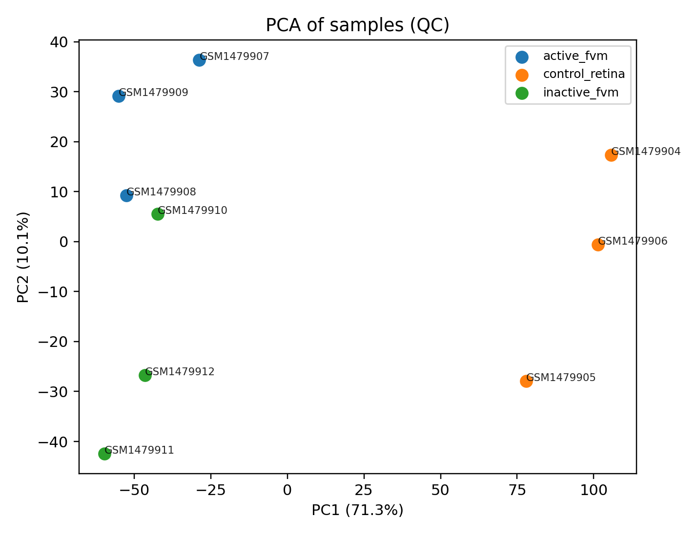

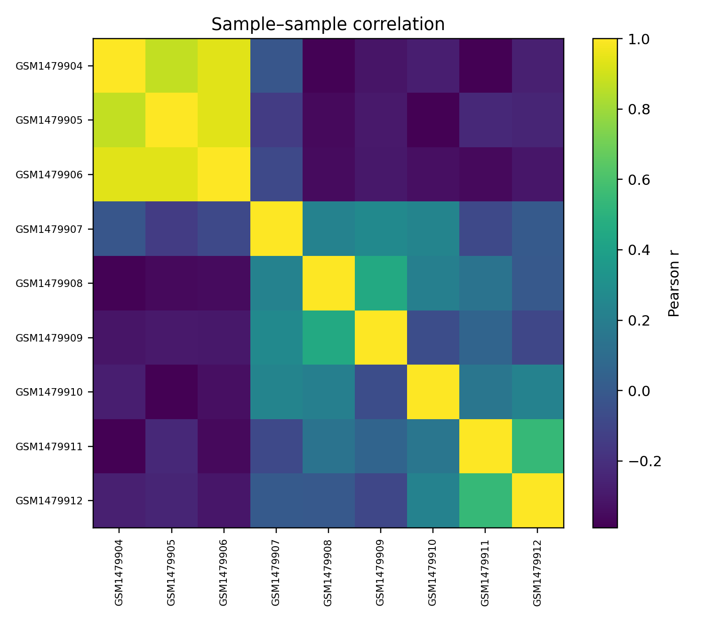

---

## Contrast: active_fvm_vs_control_retina

### Volcano

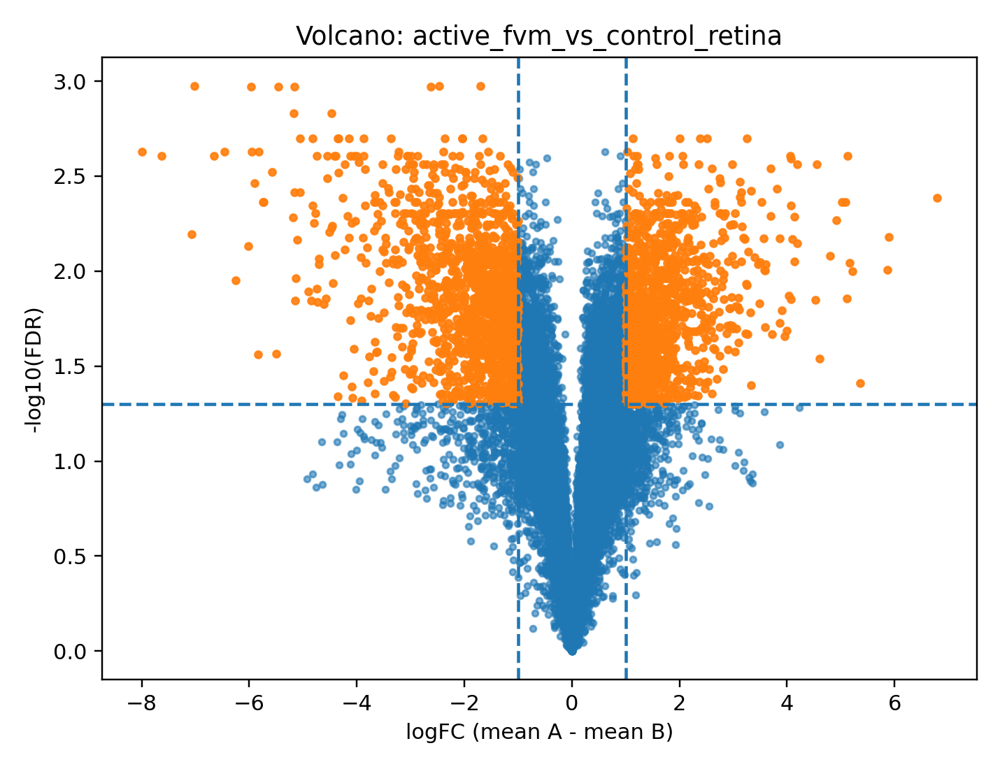

### Reactome Enrichment

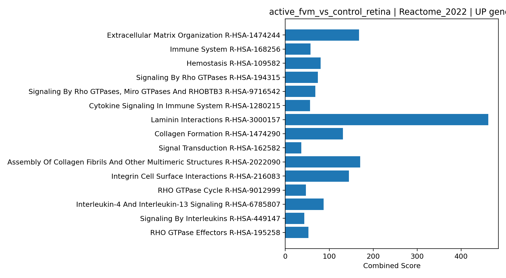

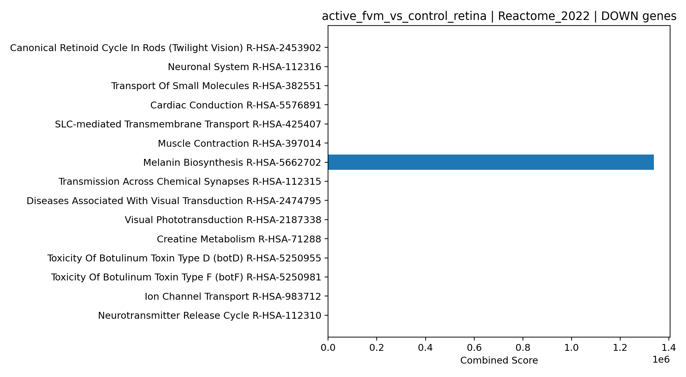

### Drug Repurposing

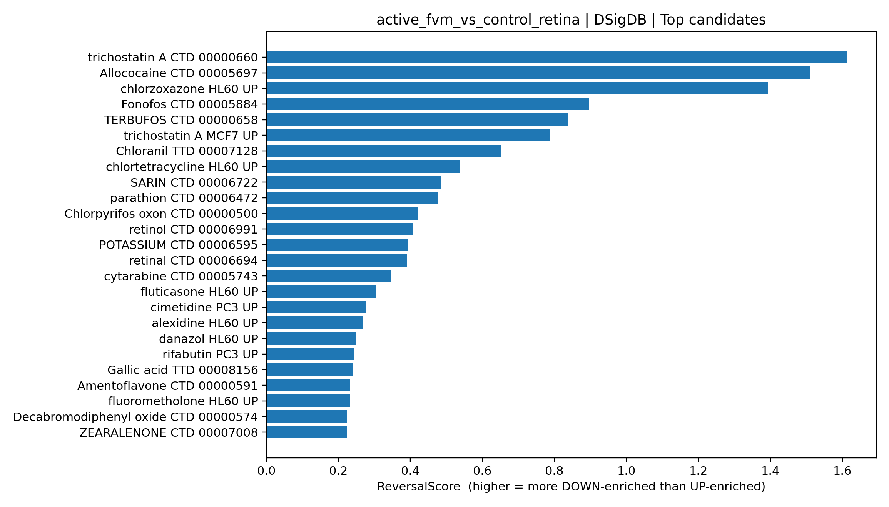

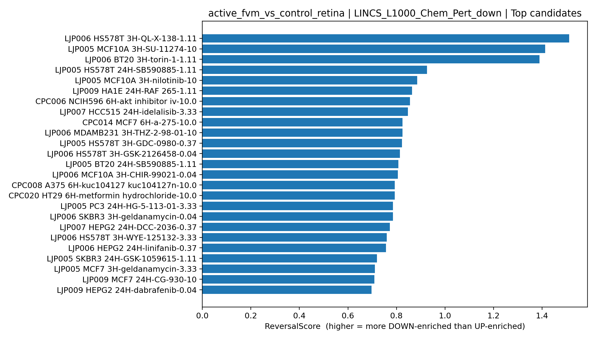

### Top Drug Candidates (tables)

**DSigDB (Top 10)**

| Term                        |   ReversalScore |    FDR_DOWN |      FDR_UP |
|:----------------------------|----------------:|------------:|------------:|
| trichostatin A CTD 00000660 |        1.61318  | 2.84342e-11 | 1.16687e-09 |
| Allococaine CTD 00005697    |        1.50996  | 0.00841509  | 0.272285    |
| chlorzoxazone HL60 UP       |        1.39212  | 0.0338468   | 0.8349      |
| Fonofos CTD 00005884        |        0.896979 | 0.0667814   | 0.526786    |
| TERBUFOS CTD 00000658       |        0.83739  | 0.0687609   | 0.472859    |
| trichostatin A MCF7 UP      |        0.787487 | 0.143906    | 0.8822      |
| Chloranil TTD 00007128      |        0.651874 | 0.1429      | 0.641072    |
| chlortetracycline HL60 UP   |        0.538128 | 0.236898    | 0.817879    |
| SARIN CTD 00006722          |        0.485059 | 0.1519      | 0.464107    |
| parathion CTD 00006472      |        0.477397 | 0.111622    | 0.335079    |

**LINCS Chem Pert DOWN (Top 10)**

| Term                                    |   ReversalScore |   FDR_DOWN |     FDR_UP |
|:----------------------------------------|----------------:|-----------:|-----------:|
| LJP006 HS578T 3H-QL-X-138-1.11          |        1.5116   |  0.0307896 | nan        |
| LJP005 MCF10A 3H-SU-11274-10            |        1.41274  |  0.0307896 |   0.796418 |
| LJP006 BT20 3H-torin-1-1.11             |        1.38929  |  0.0408044 | nan        |
| LJP005 HS578T 24H-SB590885-1.11         |        0.925654 |  0.0408044 |   0.343843 |
| LJP005 MCF10A 3H-nilotinib-10           |        0.885059 |  0.130299  | nan        |
| LJP009 HA1E 24H-RAF 265-1.11            |        0.863718 |  0.120246  |   0.878596 |
| CPC006 NCIH596 6H-akt inhibitor iv-10.0 |        0.85554  |  0.120246  |   0.862206 |
| LJP007 HCC515 24H-idelalisib-3.33       |        0.847516 |  0.133154  |   0.937283 |
| CPC014 MCF7 6H-a-275-10.0               |        0.825132 |  0.0972963 |   0.650471 |
| LJP006 MDAMB231 3H-THZ-2-98-01-10       |        0.825121 |  0.133154  |   0.890174 |

---

## Contrast: inactive_fvm_vs_control_retina

### Volcano

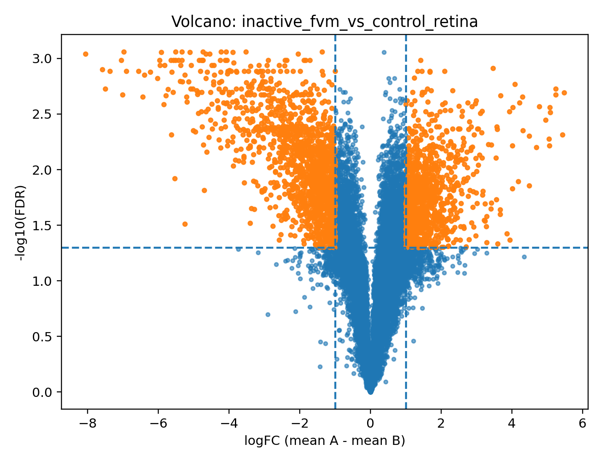

### Reactome Enrichment

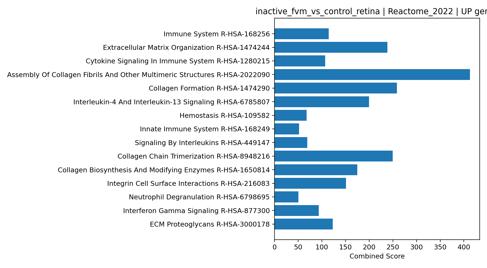

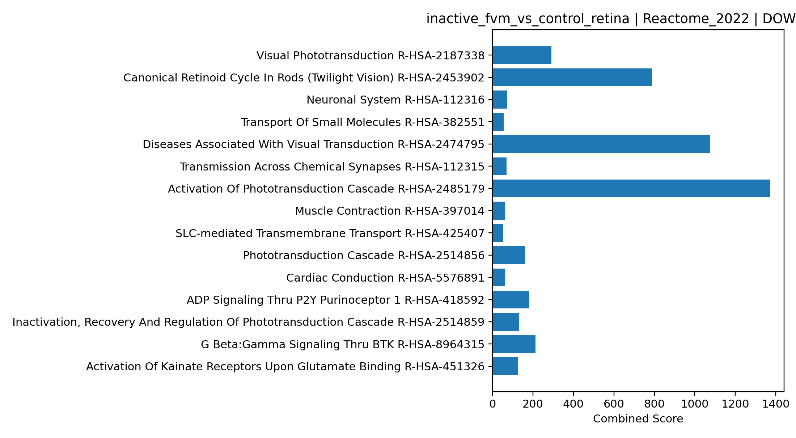

### Drug Repurposing

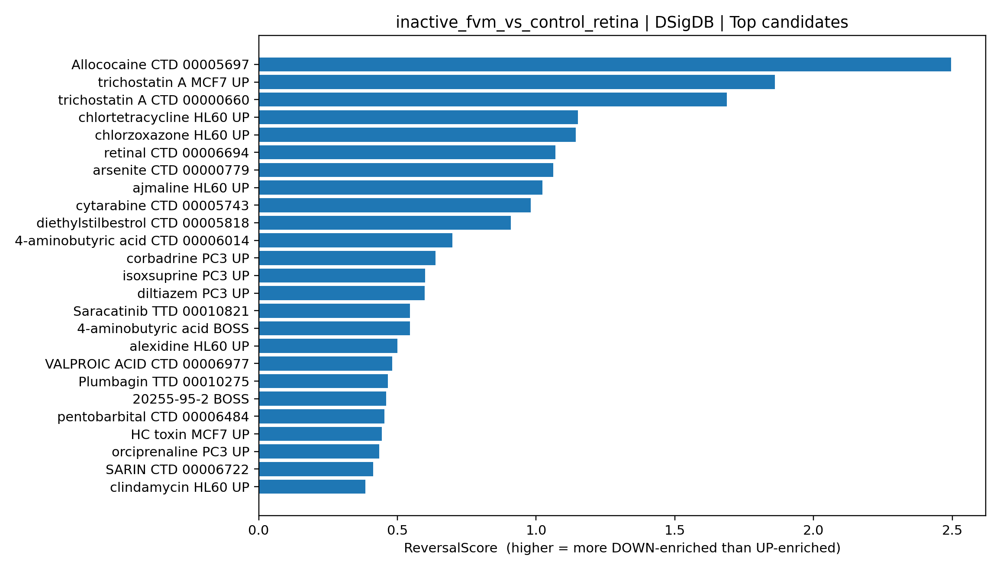

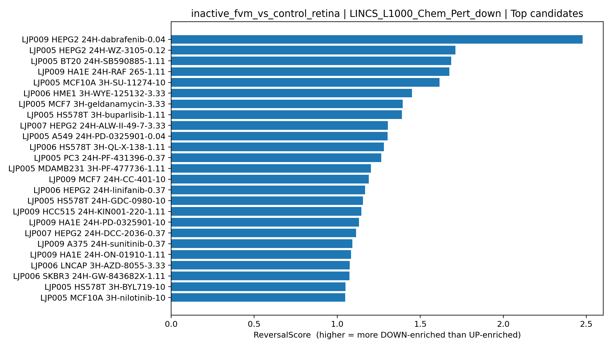

### Top Drug Candidates (tables)

**DSigDB (Top 10)**

| Term                            |   ReversalScore |    FDR_DOWN |      FDR_UP |
|:--------------------------------|----------------:|------------:|------------:|
| Allococaine CTD 00005697        |        2.49579  | 0.000367988 | 0.115245    |
| trichostatin A MCF7 UP          |        1.86034  | 0.00751604  | 0.544914    |
| trichostatin A CTD 00000660     |        1.68777  | 1.06897e-14 | 5.20881e-13 |
| chlortetracycline HL60 UP       |        1.15064  | 0.0649476   | 0.918772    |
| chlorzoxazone HL60 UP           |        1.14347  | 0.0665917   | 0.926599    |
| retinal CTD 00006694            |        1.07024  | 0.0665917   | 0.782813    |
| arsenite CTD 00000779           |        1.06103  | 9.54415e-05 | 0.00109842  |
| ajmaline HL60 UP                |        1.02254  | 0.0705933   | 0.743546    |
| cytarabine CTD 00005743         |        0.980551 | 1.36743e-08 | 1.30754e-07 |
| diethylstilbestrol CTD 00005818 |        0.90961  | 0.0133546   | 0.108453    |

**LINCS Chem Pert DOWN (Top 10)**

| Term                              |   ReversalScore |   FDR_DOWN |   FDR_UP |
|:----------------------------------|----------------:|-----------:|---------:|
| LJP009 HEPG2 24H-dabrafenib-0.04  |         2.47751 |  0.0025841 | 0.775928 |
| LJP005 HEPG2 24H-WZ-3105-0.12     |         1.71082 |  0.0175818 | 0.903396 |
| LJP005 BT20 24H-SB590885-1.11     |         1.68634 |  0.0175818 | 0.853895 |
| LJP009 HA1E 24H-RAF 265-1.11      |         1.67484 |  0.0175818 | 0.831581 |
| LJP005 MCF10A 3H-SU-11274-10      |         1.61644 |  0.0175818 | 0.726953 |
| LJP006 HME1 3H-WYE-125132-3.33    |         1.44942 |  0.0326808 | 0.919835 |
| LJP005 MCF7 3H-geldanamycin-3.33  |         1.39344 |  0.0373003 | 0.922903 |
| LJP005 HS578T 3H-buparlisib-1.11  |         1.38988 |  0.0152991 | 0.37544  |
| LJP007 HEPG2 24H-ALW-II-49-7-3.33 |         1.30484 |  0.0283431 | 0.57185  |
| LJP005 A549 24H-PD-0325901-0.04   |         1.30316 |  0.0287557 | 0.577948 |

---
